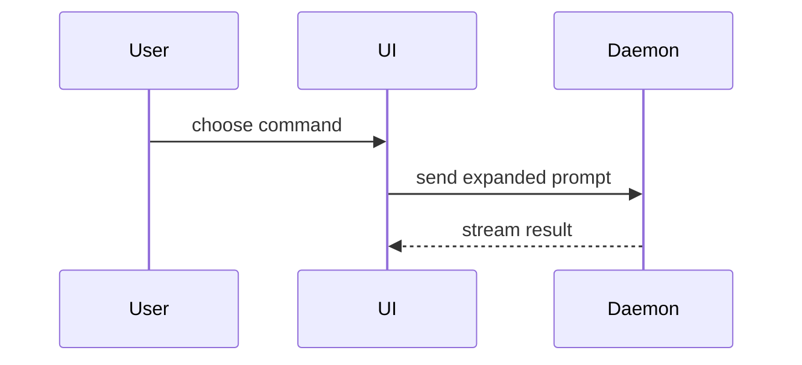

# PR

## Table of contents

- [Sections](#sections)
  - [Summary](#summary)
  - [Evidence](#evidence)
  - [Merge danger](#merge-danger)

The target branch is the one the user names, otherwise the repository's default branch. Read the whole change set against the target branch and its commit messages before writing. When the repository cannot be read, write from the supplied change material, which is every file attached to the request or present in the working directory: list the working directory and read those files before asking the user for anything, and name the unreadable repository in Evidence.

Use the project's domain vocabulary: follow `docs/agents/domain.md` when it exists; otherwise use the root `CONTEXT-MAP.md` to locate the affected contexts' `CONTEXT.md`, or the root `CONTEXT.md` for a single context. When domain documents are absent, use the existing code's terms.

Use this template:

```markdown
## Summary

<optional: the closing link to the work item the change completes, in the form the tracker contract names; Closes #id on GitHub>

<one or two sentences naming the key point>

<visual: pseudocode, tree, Mermaid, diff, or code block>

## Evidence

- **Before:** <screenshot/output/failing test run>
  **After:** <screenshot/output/passing test run>

## Merge Danger

**Door:** <one-way or two-way>

<optional: description>

**Blast Radius:** <the scope a regression reaches>

<optional: potential ramifications of merge>
```

Unless the user asks to open the PR, your response to the user is the body itself, as Markdown with brief prose, from `## Summary` to the end of Merge Danger with nothing before or after it, also when the input was a file. When the user asks to open the PR, publish it through the PR-opening operation in `docs/agents/issue-tracker.md` when the contract names one, otherwise with the pull request system's CLI (`gh pr create --base <target-branch> --title "..." --body-file <file>` on GitHub), and return `PR: <url>`. When publishing fails, keep the body and report `PR publication failed: <operation>; <error>; body: <path>`.

**Complete when:** the body has all three sections, each visual sits next to the text it supports, the evidence shows before and after or states what was not captured, and the merge danger names the door and the blast radius.

## Sections

### Summary

Pick the smallest view that makes the key point clear. Place each visual next to the short text it supports, trimmed to the calls, files, props, states, and boundaries the point needs. One visual usually suffices; several are fine when each answers a different reviewer question.

- Show logic or an algorithm as pseudocode:

```text
on(save)
  if content is unchanged
    return cached result
  write new content
  return fresh result
```

- Show runtime control flow as a call tree:

```text
submitForm
  createSession
    persistPrompt
    launchAgent
  navigateToSession
```

- Show UI structure as a component tree, including state and module boundaries that matter:

```text
<SessionPage> (apps/example/src/routes/session.tsx)
  useSessionEvents()
  <SessionToolbar>
    <RunSkillButton> (packages/ui)
```

- Show file responsibility or a broad refactor as a shallow file tree:

```text
src/
├── commands/       # parses user actions
├── sessions/       # owns session state
└── transport/      # sends API requests
```

- Show component interaction or data flow with Mermaid:



- Show what changes, when the surrounding shape already exists, as a `diff`: the tree or pseudocode above with `+` and `-` lines.

For a component change:

```diff
 <SessionPage>
   useSessionEvents()
   <SessionToolbar>
+    <RunSkillButton />
   <SessionTimeline>
+    <SkillResultCard />
```

For a state or control-flow change:

```diff
 on(save)
-  write content
+  if content is unchanged
+    return cached result
+  write new content
+  invalidate cache
```

- Show code that is mostly new, whose omitted context would hide ownership or order, or that the reviewer needs as a copyable target shape, as the whole block:

```ts
function expandSkill(command: string): string {
  const skillName = command.slice(1);
  return `use the ${skillName} skill`;
}
```

### Evidence

Screenshots rank first when the change is visual and the environment can capture them. Execution evidence ranks next: test results and console output, naming the exact test that failed before and passes now. For each side the environment cannot capture, write the command that produces it and state that it was not run.

### Merge danger

Name the **door**: one-way when the merge cannot be walked back (destructive migrations, published interfaces), two-way when a revert restores the previous state.

Name the **blast radius**: the scope a regression would reach, such as layout shift, breakage for consumers, mobile responsiveness, data, or performance.
