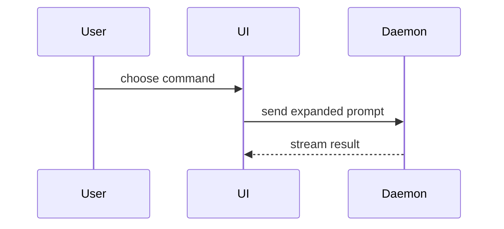

# PR

## Table of contents

- [Sections](#sections)
  - [Summary](#summary)
  - [Evidence](#evidence)
  - [Merge danger](#merge-danger)

Write a pull request body a reviewer can check quickly. Read the whole change set against the target branch and its commit messages before writing. Use the project's domain vocabulary: read `docs/agents/domain.md` when it exists, otherwise the relevant `CONTEXT.md`. Skip preambles and keep prose brief.

Use this template:

```markdown
## Summary

<diagram, diff-sketch, or tree>

## Evidence

- **Before:** <screenshot/output/failing test run>
  **After:** <screenshot/output/passing test run>

## Merge Danger

**Door:** <one-way or two-way>

<optional: description>

**Blast Radius:** <one-word description>

<optional: potential ramifications of merge>
```

Return the body as Markdown. When the user asks to open the PR, publish it through the tracker contract in `docs/agents/issue-tracker.md` when it exists.

**Complete when:** the body has all three sections, each visual sits next to the text it supports, the evidence shows before and after, and the merge danger names the door and the blast radius.

## Sections

### Summary

Pick the smallest view that makes the key point clear. Place each visual next to the short text it supports, trimmed to the calls, files, props, states, and boundaries the point needs. One visual usually suffices; several are fine when each answers a different reviewer question.

- Show logic or an algorithm as pseudocode:

```text
on(save)
  if content is unchanged
    return cached result
  write new content
  return fresh result
```

- Show runtime control flow as a call tree:

```text
submitForm
  createSession
    persistPrompt
    launchAgent
  navigateToSession
```

- Show UI structure as a component tree, including state and module boundaries that matter:

```text
<SessionPage> (apps/example/src/routes/session.tsx)
  useSessionEvents()
  <SessionToolbar>
    <RunSkillButton> (packages/ui)
```

- Show file responsibility or a broad refactor as a shallow file tree:

```text
src/
├── commands/       # parses user actions
├── sessions/       # owns session state
└── transport/      # sends API requests
```

- Show component interaction, control flow, or data flow with Mermaid:



- Use `diff` when the point is what changes and the surrounding shape already exists. Match the diff shape to the topic.

For a component change:

```diff
 <SessionPage>
   useSessionEvents()
   <SessionToolbar>
+    <RunSkillButton />
   <SessionTimeline>
+    <SkillResultCard />
```

For a file-layout change:

```diff
 src/
 ├── commands/
+│   └── show-me.ts       # expands the slash command
 ├── sessions/
-└── transport.ts
+└── transport/
+    ├── client.ts
+    └── stream.ts
```

For a call-tree or call-stack change:

```diff
 submitForm
   createSession
     persistPrompt
+    expandSkillMention
     launchAgent
-  navigateToSession
+  navigateToSession
+    subscribeToEvents
```

For a state or control-flow change:

```diff
 on(save)
-  write content
+  if content is unchanged
+    return cached result
+  write new content
+  invalidate cache
```

- Show the whole block when most of it is new, when omitted context would hide ownership or order, or when the reviewer needs a copyable target shape:

```ts
function expandSkill(command: string): string {
  const skillName = command.slice(1);
  return `use the ${skillName} skill`;
}
```

### Evidence

Concrete evidence that the change works, shown as before and after. Screenshots rank first when the change is visual and the environment can capture them. Execution evidence ranks next: test results and console output, naming the exact test that failed before and passes now.

### Merge danger

Name the **door**. A two-way door can be walked back; a one-way door cannot. A PR that is cheap to roll back is lower risk; destructive actions and hard-to-reverse decisions are one-way doors.

Name the **blast radius**: the scope a regression would reach, such as layout shift, breakage for consumers, mobile responsiveness, data, or performance.
